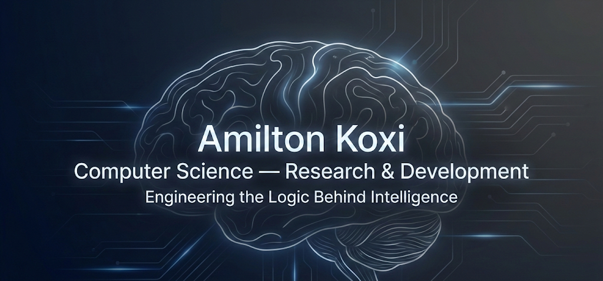

  
  

  # Amilton Koxi
  ### R&D Engineer | IoT • Embedded Systems • Cloud Architect

  

    <b>Bridging the gap between Hardware Constraints and Cloud Intelligence</b>
  

  
  
  

 

---

### 👨‍💻 About Me

I am a multidisciplinary **R&D Engineer** focused on **end-to-end intelligent systems** — designing architectures that span from embedded hardware (STM32/FPGA) to distributed cloud infrastructures.

Currently finalizing my **second M.Sc. in Computer Science Engineering** (Cloud & AI) at the University of Debrecen, complementing my previous **M.Sc. in Infocommunication Technologies** (Secure Telecom).

* 🔭 **Focus:** FPGA-accelerated Edge AI & Swarm Intelligence for WSN.
* 🌱 **Learning:** Advanced Azure Architectures & MLOps.
* 💡 **Goal:** Creating scalable architectures that turn sensor data into actionable intelligence.

---

### 🛠 Tech Stack & Arsenal

| **Embedded & FPGA** | **Cloud & DevOps** | **AI & Intelligence** | **Languages** |
|:---:|:---:|:---:|:---:|
|   |   |   |   |
|   |   |   |   |

---

### 🏆 Selected Honors & Awards

* [cite_start]🥇 **TalentUD Excellence Program (2025)** – Selected for outstanding R&D contributions at University of Debrecen[cite: 69].
* [cite_start]🎓 **Stipendium Hungaricum Scholarship (2024)** – Full Merit Scholarship for M.Sc. studies[cite: 44].
* [cite_start]🏆 **1st Place Award, Technical Sciences (2024)** – International Scientific Conference (Penza, Russia)[cite: 47].

---

### 🔭 Featured Projects

| Project | Description | Stack |
| :--- | :--- | :--- |
| **🤖 FPGA-Accelerated Edge AI** | Real-time image contour detection & BNN inference on PYNQ-Z2. Outperforms CPU execution. | `Vivado HLS` `FINN` `Python` |
| **🐝 RA-PSO-LEACH Swarm** | Adaptive routing protocol for WSN using PSO for energy-efficient clustering. | `MATLAB` `Algorithms` `WSN` |
| **☁️ IoT Cloud Architecture** | End-to-end sensor → edge → cloud telemetry pipeline with anomaly detection. | `Azure IoT` `Python` `REST API` |
| **📄 NutriParse AI Reader** | Full-stack OCR/NLP system extracting nutritional info from PDFs. | `FastAPI` `Next.js` `NLP` |

---

### ⚡ GitHub Stats

  

