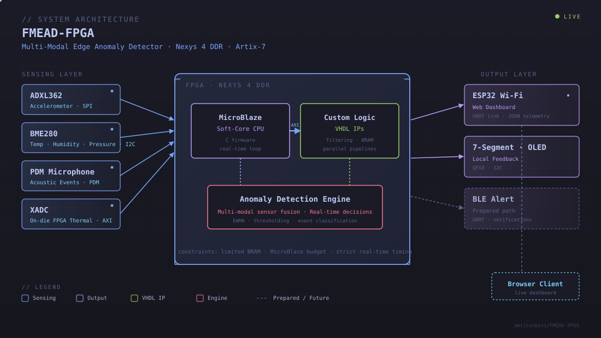
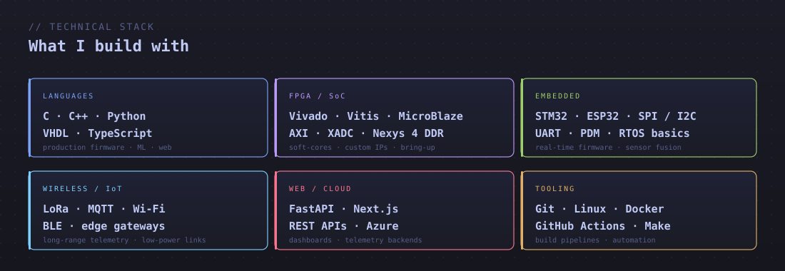

<!-- =========================================================
     AMILTON KOXI · GitHub Profile README
     Design system: Tokyo Night
     Embedded Systems · FPGA · Edge AI · Intelligent Sensing
     ========================================================= -->

<div align="center">
  
</div>

<br/>

<div align="center">
  <a href="https://github.com/amiltonkoxi">
    
  </a>
</div>

<br/>

<div align="center">

I build embedded and FPGA based intelligent systems where sensing, firmware, hardware interfaces, and edge decision logic must work together under real constraints.

</div>

<br/>

<div align="center">
  <a href="https://www.linkedin.com/in/amiltonkoxi/">
    
  </a>
  &nbsp;
  <a href="https://github.com/amiltonkoxi">
    
  </a>
  &nbsp;
  <a href="mailto:amiltonkoxi2023@gmail.com">
    
  </a>
</div>

<br/>

<div align="center">
  
</div>

## &nbsp;`01` &nbsp; Profile

```yaml
name:        Amilton Koxi
role:        R&D Engineer
focus:       Embedded systems · FPGA · edge AI · intelligent sensing
languages:   C · C++ · Python · VHDL
hardware:    Nexys 4 DDR · MicroBlaze · STM32 · ESP32 · LoRa
tools:       Vivado · Vitis · Git · Power BI · Azure SQL
mindset:     Hardware first · research driven · system level thinking
open_to:     Research collaboration · embedded R&D · FPGA projects
```

I work on practical intelligent systems where software alone is not enough. My projects combine sensors, firmware, FPGA logic, communication modules, dashboards, and real time decision logic.

I am especially interested in systems that must survive real engineering limits: small memory, noisy signals, strict timing, hardware bring up, unreliable communication, and limited processing power.

The part many demos hide is usually the part I enjoy most.

<div align="center">
  
</div>

## &nbsp;`02` &nbsp; Current Focus

<table>
<tr>
<td width="33%" valign="top">

### Building

**FMEAD FPGA**

A multi modal edge anomaly detector running on a Nexys 4 DDR board with MicroBlaze, sensors, local display feedback, and Wi Fi telemetry.

</td>
<td width="33%" valign="top">

### Researching

**Post quantum hardware acceleration**

FPGA oriented acceleration of cryptographic primitives for IoT and connected embedded systems.

</td>
<td width="33%" valign="top">

### Exploring

**Reliable edge sensing**

Adaptive anomaly detection for wireless sensor networks across edge, gateway, and fog layers.

</td>
</tr>
</table>

<div align="center">
  
</div>

## &nbsp;`03` &nbsp; Flagship Project

<div align="center">

# FMEAD FPGA

**FPGA Multi Modal Edge Anomaly Detector**  
Nexys 4 DDR · MicroBlaze · VHDL · Bare metal C · Edge AI

</div>

FMEAD FPGA is a real time edge sensing platform that detects abnormal physical events directly on FPGA based embedded hardware. It combines motion, environmental, acoustic, and thermal signals, then exposes system status through local displays and a Wi Fi dashboard.

The goal is simple: detect meaningful events close to the sensors without depending on a remote computer or cloud service.

<br/>

<div align="center">
  
</div>

<br/>

<table>
<tr>
<td width="58%" valign="top">

### What it does

- Reads motion data from an ADXL362 accelerometer
- Reads environmental data from a BME280 sensor
- Monitors FPGA temperature through XADC
- Detects simple acoustic events from a PDM microphone
- Displays local status through 7 segment display and OLED support
- Serves a browser dashboard through an ESP32 Wi Fi module
- Runs anomaly logic directly on the embedded FPGA platform

</td>
<td width="42%" valign="top">

### Engineering focus

- Sensor bring up over SPI and I2C
- AXI integration with MicroBlaze
- Bare metal firmware design
- Custom VHDL peripheral integration
- Real time display refresh
- Memory safe dashboard handling
- Embedded anomaly scoring

</td>
</tr>
</table>

<br/>

<table>
<tr>
<td width="50%" valign="top">

### Main constraints

- Limited BRAM
- Limited MicroBlaze processing budget
- Timing sensitive display updates
- Noisy real world sensor data
- ESP32 AT command limitations
- HTML dashboard memory pressure

</td>
<td width="50%" valign="top">

### Stack

`VHDL` &nbsp; `C` &nbsp; `MicroBlaze`  
`AXI` &nbsp; `SPI` &nbsp; `I2C` &nbsp; `UART`  
`Vivado` &nbsp; `Vitis` &nbsp; `ESP32 AT`  
`Nexys 4 DDR` &nbsp; `Bare metal firmware`

</td>
</tr>
</table>

<p align="right">
  <a href="https://github.com/amiltonkoxi/FMEAD-FPGA">
    <kbd>&nbsp;&nbsp;Open repository&nbsp;&nbsp;<b>→</b>&nbsp;&nbsp;</kbd>
  </a>
</p>

<div align="center">
  
</div>

## &nbsp;`04` &nbsp; Selected Projects

<table>
<tr>
<td width="50%" valign="top">

### FMEAD FPGA

Multi modal edge anomaly detector built on Nexys 4 DDR using MicroBlaze, VHDL peripherals, sensors, displays, and Wi Fi telemetry.

**Stack**  
`VHDL` `C` `MicroBlaze` `AXI` `ESP32`

</td>
<td width="50%" valign="top">

### SentinelNet

AI powered CBRNE edge platform for early threat detection and civil protection scenarios. Developed during an international hackathon.

**Stack**  
`Python` `Edge AI` `IoT` `Data Analysis`

</td>
</tr>

<tr>
<td width="50%" valign="top">

### WSN Swarm Anomaly Detection

Wireless sensor network anomaly detection using EWMA, Page Hinkley statistics, and PSO based tuning across edge, gateway, and fog layers.

**Stack**  
`ESP32` `Python` `C` `WSN` `Anomaly Detection`

</td>
<td width="50%" valign="top">

### LoRa Communication System

Long range low power telemetry experiments with sensor nodes, gateway communication, MQTT bridging, and link quality evaluation.

**Stack**  
`LoRa` `MQTT` `STM32` `Embedded C`

</td>
</tr>

<tr>
<td width="50%" valign="top">

### Nutriparse Reader

Computer vision pipeline for reading and parsing nutrition labels, designed with low resource inference in mind.

**Stack**  
`Python` `OpenCV` `Computer Vision`

</td>
<td width="50%" valign="top">

### Banknote Detection

Vision based banknote recognition prototype with a focus on embedded deployment and lightweight image processing.

**Stack**  
`Python` `OpenCV` `Machine Learning`

</td>
</tr>
</table>

<div align="center">
  
</div>

## &nbsp;`05` &nbsp; Technical Stack

<div align="center">
  
</div>

<br/>

<table>
<tr>
<td width="25%" valign="top">

### Hardware

`FPGA`  
`MicroBlaze`  
`STM32`  
`ESP32`  
`Sensors`  
`LoRa`

</td>
<td width="25%" valign="top">

### Firmware

`C`  
`C++`  
`Bare metal`  
`Drivers`  
`UART`  
`SPI`  
`I2C`

</td>
<td width="25%" valign="top">

### FPGA

`VHDL`  
`AXI`  
`Vivado`  
`Vitis`  
`Custom IP`  
`Timing`

</td>
<td width="25%" valign="top">

### Intelligence

`Python`  
`Anomaly Detection`  
`Edge AI`  
`Signal Processing`  
`Data Analysis`  
`Visualization`

</td>
</tr>
</table>

<div align="center">
  
</div>

## &nbsp;`06` &nbsp; Research Interests

<table>
<tr>
<td width="50%" valign="top">

### Edge Intelligence

On device anomaly detection under strict memory, timing, and energy constraints.

### FPGA Acceleration

Hardware acceleration for signal processing, embedded intelligence, and security primitives.

</td>
<td width="50%" valign="top">

### Wireless Sensor Networks

Reliable sensing across distributed edge, gateway, and fog architectures.

### Embedded Security

Post quantum cryptography and secure communication for IoT and connected systems.

</td>
</tr>
</table>

<div align="center">
  
</div>

## &nbsp;`07` &nbsp; Selected Achievements

```diff
+ 2026   1st place · International edge AI hackathon · SentinelNet
+ 2026   2nd place · Student research conference · OTDK nomination
+ 2025   Excellence scholarship · Academic and research recognition
+ 2024   1st place · Student research award
```

<div align="center">
  
</div>

## &nbsp;`08` &nbsp; Public Engineering Work

<table>
<tr>
<td width="50%" valign="top">

### Main Repository

**FMEAD FPGA**  
FPGA based multi modal edge anomaly detector with MicroBlaze, VHDL peripherals, sensors, displays, and Wi Fi telemetry.

<br/>

<a href="https://github.com/amiltonkoxi/FMEAD-FPGA">
  <kbd>&nbsp;&nbsp;View repository&nbsp;&nbsp;→&nbsp;&nbsp;</kbd>
</a>

</td>
<td width="50%" valign="top">

### Engineering Focus

My public GitHub highlights selected embedded systems, FPGA experiments, research prototypes, and technical documentation.

Most of my FPGA, academic, and research work is developed in private or university repositories. The public work here is a selected technical snapshot.

</td>
</tr>
</table>

<br/>

<table>
<tr>
<td width="33%" valign="top">

### Hardware First

I work close to the board: sensors, buses, displays, soft processors, timing, memory limits, and real device behavior.

</td>
<td width="33%" valign="top">

### Real Time Firmware

I design bare metal logic that reads signals, updates outputs, handles communication, and keeps the system responsive.

</td>
<td width="33%" valign="top">

### Edge Intelligence

I focus on lightweight decision logic that runs close to the sensor instead of depending fully on cloud processing.

</td>
</tr>
</table>

<div align="center">
  
</div>

<div align="center">

## Let’s build systems that run on real hardware.

I am open to research collaboration, embedded R&D work, FPGA based projects, and long term technical opportunities.

<br/>

<a href="https://www.linkedin.com/in/amiltonkoxi/">
  
</a>
&nbsp;
<a href="mailto:amiltonkoxi2023@gmail.com">
  
</a>
&nbsp;
<a href="https://github.com/amiltonkoxi">
  
</a>

<br/><br/>

<sub>
Embedded systems · FPGA · Edge AI · Wireless sensor networks · Research prototypes
</sub>

</div>
